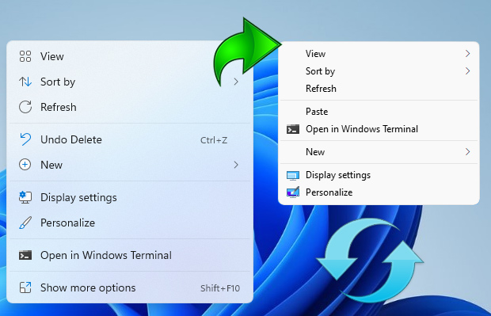

# Context Menu Registry

[TOC]

右键菜单相关注册表。

## 右键菜单清理

各种软件会在安装后为你的 Windows 系统右键菜单添加一些项目，而大部分软件却不提供删除选项，为了保证用户的自由选择权，这里提供了不同软件的清理选项。

该目录下 `clean-*.reg` 文件为清理右键菜单的注册表文件，下载到本地后，双击打开完成导入即可。

之所以需要删除的原因大致如下：

- 频率低：很多右键菜单实际的使用频率非常低。
- 可替代：很多功能都可以打开软件后进行操作，没必要占用右键菜单。例如 QQ 发送给好友、WPS 上传到云文档等等。
- 占空间：在打开右键菜单时，大量的菜单项会影响我们做选择的效率，针对小屏幕时甚至还需要额外的上下滚动。
- 占资源：每次打开右键菜单时，Windows 都会读取对应的注册表项目，以及执行对应 DLL 文件，这些都会占用一定的系统资源，有时甚至会显著拖慢右键菜单打开速度甚至卡死资源管理器，打开右键菜单属于相对高频的操作，存在大量低频项目的加载非常日常影响效率。

当然，不可否认右键菜单某种程度可以给用户带来一些便利，但对于我来说，牺牲极少的便利性带来更高的效率及使用体验，是比较值得的。所以如何权衡？就把选择权还给用户把。

以下是目录下对应的文件说明：

| FILENAME                 | REMARK                               |
| :----------------------- | :----------------------------------- |
| clean-kuwo.reg           | 酷我音乐的右键菜单                   |
| clean-baidu-net-disk.reg | 上传到百度网盘                       |
| clean-mail-master.reg    | 通过网易邮箱大师发送                 |
| clean-qq.reg             | QQ 右键菜单（发送给好友等）          |
| clean-wps.reg            | WPS 右键菜单（上传到“WPS 云文档”等） |

## Windows 11 右键菜单

大部分人并不习惯于当前 Windows 11 新设计的右键菜单，为了设计牺牲了效率是不值得的。这里不多赘述这饱受诟病新版右键菜单，网上实在太多了。

在这里会提供一些注册表和命令行，它们可以帮助你在 Windows 11 中将注册表切换到旧的 Windows 10 版本，或者恢复到 Windows 11 的版本。

| FILENAME                                            | REMARK                                                    |
| :-------------------------------------------------- | :-------------------------------------------------------- |
| windows11-get-the-default-context-menu-back.cmd     | 恢复默认的 Windows 11 右键菜单                            |
| windows11-get-the-default-context-menu-back.reg     | 恢复默认的 Windows 11 右键菜单                            |
| windows11-restore-full-right-click-context-menu.cmd | 在 Windows 11 中恢复完整的右键菜单显示（类似 Windows 10） |
| windows11-restore-full-right-click-context-menu.reg | 在 Windows 11 中恢复完整的右键菜单显示（类似 Windows 10） |

### References

- [Windows 11 Classic Context Menu v1.1](https://www.sordum.org/14479/windows-11-classic-context-menu-v1-1/)
